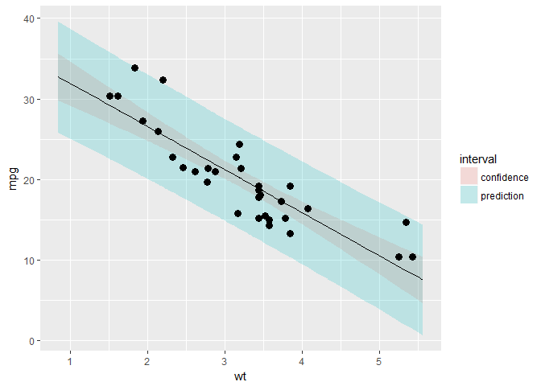

JHU Coursera Regression Model Quizes
================
Autoz
2018-07-31

-   [JHU DataScience Specialization/Cousers Reproducible Data/Week1-4/Regression Model Quizes](#jhu-datascience-specializationcousers-reproducible-dataweek1-4regression-model-quizes)
-   [Quizes](#quizes)
    -   [Week 2](#week-2)
    -   [Week 3](#week-3)
    -   [Week 4](#week-4)

JHU DataScience Specialization/Cousers Reproducible Data/Week1-4/Regression Model Quizes
========================================================================================

Quizes
======

主要练习手工计算回归模型的基础方法

Week 2
------

### Quiz 1

手算均值

``` r
x <- c(0.18, -1.54, 0.42, 0.95)
w <- c(2, 1, 3, 1)
mu.y <- sum(w * x) / sum(w)
sprintf("mean of y is : %f",mu.y)
```

    ## [1] "mean of y is : 0.147143"

### Quiz 2

线性回归

``` r
x <- c(0.8, 0.47, 0.51, 0.73, 0.36, 0.58, 0.57, 0.85, 0.44, 0.42)
y <- c(1.39, 0.72, 1.55, 0.48, 1.19, -1.59, 1.23, -0.65, 1.49, 0.05)
pander(lm(y~x)) #THROUGH THE ORIGIN
```

<table style="width:86%;">
<caption>Fitting linear model: y ~ x</caption>
<colgroup>
<col width="25%" />
<col width="15%" />
<col width="18%" />
<col width="13%" />
<col width="13%" />
</colgroup>
<thead>
<tr class="header">
<th align="center"> </th>
<th align="center">Estimate</th>
<th align="center">Std. Error</th>
<th align="center">t value</th>
<th align="center">Pr(&gt;|t|)</th>
</tr>
</thead>
<tbody>
<tr class="odd">
<td align="center"><strong>(Intercept)</strong></td>
<td align="center">1.567</td>
<td align="center">1.252</td>
<td align="center">1.252</td>
<td align="center">0.246</td>
</tr>
<tr class="even">
<td align="center"><strong>x</strong></td>
<td align="center">-1.713</td>
<td align="center">2.105</td>
<td align="center">-0.8136</td>
<td align="center">0.4394</td>
</tr>
</tbody>
</table>

``` r
pander(lm(y~x-1)) #去除截距
```

<table style="width:74%;">
<caption>Fitting linear model: y ~ x - 1</caption>
<colgroup>
<col width="12%" />
<col width="15%" />
<col width="18%" />
<col width="13%" />
<col width="13%" />
</colgroup>
<thead>
<tr class="header">
<th align="center"> </th>
<th align="center">Estimate</th>
<th align="center">Std. Error</th>
<th align="center">t value</th>
<th align="center">Pr(&gt;|t|)</th>
</tr>
</thead>
<tbody>
<tr class="odd">
<td align="center"><strong>x</strong></td>
<td align="center">0.8263</td>
<td align="center">0.5817</td>
<td align="center">1.421</td>
<td align="center">0.1892</td>
</tr>
</tbody>
</table>

### Quiz 3

mtcars 回归系数

<table style="width:31%;">
<colgroup>
<col width="19%" />
<col width="11%" />
</colgroup>
<thead>
<tr class="header">
<th align="center">(Intercept)</th>
<th align="center">wt</th>
</tr>
</thead>
<tbody>
<tr class="odd">
<td align="center">37.29</td>
<td align="center">-5.344</td>
</tr>
</tbody>
</table>

### Quiz 4

练习求b1
$$
Cor(Y,X) = 0.5 \\qquad
Sd(Y) = 1  \\qquad Sd(X) = 0.5 \\\\ 
\\beta\_1 = Cor(Y,X) \* \\frac{Sd(Y)}{Sd(X)}
$$

``` r
B1 = 0.5 * 1 / 0.5
```

### Quiz 5

``` r
corr <- .4; emean <- 0; varr1 <- 1
varr2 <- 1; b0 <- 0; x <- 1.5
b1 <- corr * sqrt(varr1) / sqrt(varr2)
(y <- b0 + b1 * x)
```

    ## [1] 0.6

### Quiz 6

``` r
x <- c(8.58, 10.46, 9.01, 9.64, 8.86)
(x - mean(x)) / sd(x) # Choose No.1
```

    ## [1] -0.9718658  1.5310215 -0.3993969  0.4393366 -0.5990954

### Quiz 7

``` r
x <- c(0.8, 0.47, 0.51, 0.73, 0.36, 0.58, 0.57, 0.85, 0.44, 0.42)
y <- c(1.39, 0.72, 1.55, 0.48, 1.19, -1.59, 1.23, -0.65, 1.49, 0.05)
lm(y~x)
```

    ## 
    ## Call:
    ## lm(formula = y ~ x)
    ## 
    ## Coefficients:
    ## (Intercept)            x  
    ##       1.567       -1.713

### Quiz 8

> It must be identically 0.

### Quiz 9

``` r
x <- c(0.8, 0.47, 0.51, 0.73, 0.36, 0.58, 0.57, 0.85, 0.44, 0.42)
mean(x)
```

    ## [1] 0.573

### Quiz 10

$$
\\beta\_1=Cor(Y,X)\*Sd(Y)/Sd(X) \\\\ 
Y\_1=Cor(Y,X)\*Sd(X)/Sd(Y) \\\\
\\beta\_1/Y\_1= Sd(Y)^2/Sd(X)^2 = Var(Y)/Var(X)
$$

Week 3
------

### Quiz 1

求系数

``` r
x <- c(0.61, 0.93, 0.83, 0.35, 0.54, 0.16, 0.91, 0.62, 0.62)
y <- c(0.67, 0.84, 0.6, 0.18, 0.85, 0.47, 1.1, 0.65, 0.36)
fit <- lm(y~x)
pander(summary(fit)$coefficients)
```

<table style="width:86%;">
<colgroup>
<col width="25%" />
<col width="15%" />
<col width="18%" />
<col width="13%" />
<col width="13%" />
</colgroup>
<thead>
<tr class="header">
<th align="center"> </th>
<th align="center">Estimate</th>
<th align="center">Std. Error</th>
<th align="center">t value</th>
<th align="center">Pr(&gt;|t|)</th>
</tr>
</thead>
<tbody>
<tr class="odd">
<td align="center"><strong>(Intercept)</strong></td>
<td align="center">0.1885</td>
<td align="center">0.2061</td>
<td align="center">0.9143</td>
<td align="center">0.391</td>
</tr>
<tr class="even">
<td align="center"><strong>x</strong></td>
<td align="center">0.7224</td>
<td align="center">0.3107</td>
<td align="center">2.325</td>
<td align="center">0.05296</td>
</tr>
</tbody>
</table>

### Quiz 2

总平方和与回归与残差关系

$$
y\_i = \\beta\_0 + \\beta\_1 x\_i + e\_i \\\\
\\hat y\_i = \\beta\_0 + \\beta\_1 x\_i + e\_i \\\\
e\_i = y\_i - \\hat y\_i \\\\
SS\_{total} = \\|y\_i-\\bar y \\mathbf{1}\\|^2 = \\sum\_{i=1}^n (y\_i-\\bar y)^2 \\\\ 
= \\| \\hat y\_i-\\bar y \\mathbf{1}\\|^2 + \\|\\hat \\epsilon\\|  
= \\sum\_{i=1}^n (\\hat y\_i-\\bar y)^2 + \\sum\_{i=1}^n (y\_i-\\hat y)^2 \\\\ 
= SS\_{regression} + SS\_{residual} \\\\ \\mathbf{1} = (1,1,\\ldots,1)^T
$$

平方和与残差

$$
SS\_x = \\sum\_{i=1}^n {(x\_i - \\bar x)^2} \\\\
e\_i = y\_i - (\\beta\_1x\_i + \\beta\_0) \\\\
\\hat \\sigma^2 = \\frac{1}{n-2} \\sum\_{i=1}^n e\_i^2 = \\frac{1}{n-2} SS\_{residual} \\sim \\chi\_{(n-2)}^2
$$

``` r
# init
n <- length(x)
beta1 <- cor(y, x) * sd(y) / sd(x)
beta0 <- mean(y) - beta1 * mean(x)
ssx <- sum((x - mean(x))^2)
e <- y - (beta1 * x + beta0)
sigma <- sqrt(sum(e^2) / (n-2))
```

方差与系数方差关系

$$
\\sigma^2\_{\\hat\\beta\_1}=Var(\\hat\\beta\_1)=\\frac{\\sigma^2}{SS\_x}\\\\
\\sigma^2\_{\\hat\\beta\_0}=Var(\\hat\\beta\_0)=(\\frac{1}{n}+\\frac{\\bar X^2}{SS\_x})\\sigma^2 \\\\
$$

$$
R^2 = \\frac{SS\_{regression}}{SS\_{total}} = \\frac{\\sum\_{i=1}^n (\\hat y\_i-\\bar y)^2}{\\sum\_{i=1}^n (y\_i-\\bar y)^2}
$$
 t分布与方差
$$
\\frac{\\hat\\beta\_j-\\beta\_j}{\\sigma\_{\\hat\\beta\_j}} \\sim t\_{\\beta\_j}(n-p)
$$

``` r
# 计算 Beta1
seBeta0 <- sqrt(1/n + mean(x)^2/ssx)*sigma
seBeta1 <- sigma / sqrt(ssx)
tBeta0 <- beta0 / seBeta0
tBeta1 <- beta1 / seBeta1
pBeta0 <- 2 * pt(tBeta0, df = n-2, lower.tail = FALSE)
pBeta1 <- 2 * pt(tBeta1, df = n-2, lower.tail = FALSE)
```

<table style="width:86%;">
<colgroup>
<col width="25%" />
<col width="15%" />
<col width="18%" />
<col width="13%" />
<col width="13%" />
</colgroup>
<thead>
<tr class="header">
<th align="center"> </th>
<th align="center">Estimate</th>
<th align="center">Std. Error</th>
<th align="center">t value</th>
<th align="center">P(&gt;|t|)</th>
</tr>
</thead>
<tbody>
<tr class="odd">
<td align="center"><strong>(Intercept)</strong></td>
<td align="center">0.1885</td>
<td align="center">0.2061</td>
<td align="center">0.9143</td>
<td align="center">0.391</td>
</tr>
<tr class="even">
<td align="center"><strong>x</strong></td>
<td align="center">0.7224</td>
<td align="center">0.3107</td>
<td align="center">2.325</td>
<td align="center">0.05296</td>
</tr>
</tbody>
</table>

### Quiz 3

Dataset: mtcars

``` r
# 构造模型
fit <- lm(mpg~wt,mtcars)
pander(summary(fit))
```

<table style="width:88%;">
<colgroup>
<col width="25%" />
<col width="15%" />
<col width="18%" />
<col width="13%" />
<col width="15%" />
</colgroup>
<thead>
<tr class="header">
<th align="center"> </th>
<th align="center">Estimate</th>
<th align="center">Std. Error</th>
<th align="center">t value</th>
<th align="center">Pr(&gt;|t|)</th>
</tr>
</thead>
<tbody>
<tr class="odd">
<td align="center"><strong>(Intercept)</strong></td>
<td align="center">37.29</td>
<td align="center">1.878</td>
<td align="center">19.86</td>
<td align="center">8.242e-19</td>
</tr>
<tr class="even">
<td align="center"><strong>wt</strong></td>
<td align="center">-5.344</td>
<td align="center">0.5591</td>
<td align="center">-9.559</td>
<td align="center">1.294e-10</td>
</tr>
</tbody>
</table>

<table style="width:86%;">
<caption>Fitting linear model: mpg ~ wt</caption>
<colgroup>
<col width="20%" />
<col width="30%" />
<col width="12%" />
<col width="22%" />
</colgroup>
<thead>
<tr class="header">
<th align="center">Observations</th>
<th align="center">Residual Std. Error</th>
<th align="center"><span class="math inline"><em>R</em><sup>2</sup></span></th>
<th align="center">Adjusted <span class="math inline"><em>R</em><sup>2</sup></span></th>
</tr>
</thead>
<tbody>
<tr class="odd">
<td align="center">32</td>
<td align="center">3.046</td>
<td align="center">0.7528</td>
<td align="center">0.7446</td>
</tr>
</tbody>
</table>

``` r
sumCoef <- summary(fit)$coefficients
b0 <- sumCoef[1,1]
b1 <- sumCoef[2,1]
seb0 <- sumCoef[1, 2]
seb1 <- sumCoef[2, 2]
b0i <- b0 + c(-1, 1) * qt(.9, df = fit$df) * seb0
b1i <- b1 + c(-1, 1) * qt(.9, df = fit$df) * seb1 
x0 <- mean(mtcars$wt)
```

<table style="width:57%;">
<colgroup>
<col width="23%" />
<col width="11%" />
<col width="11%" />
<col width="11%" />
</colgroup>
<thead>
<tr class="header">
<th align="center"> </th>
<th align="center">fit</th>
<th align="center">lwr</th>
<th align="center">upr</th>
</tr>
</thead>
<tbody>
<tr class="odd">
<td align="center"><strong>confidence</strong></td>
<td align="center">20.09</td>
<td align="center">18.99</td>
<td align="center">21.19</td>
</tr>
<tr class="even">
<td align="center"><strong>prediction</strong></td>
<td align="center">20.09</td>
<td align="center">13.77</td>
<td align="center">26.41</td>
</tr>
<tr class="odd">
<td align="center"><strong>manual</strong></td>
<td align="center">20.09</td>
<td align="center">15.27</td>
<td align="center">24.91</td>
</tr>
</tbody>
</table>



### Quiz 4

> The estimated expected change in mpg per 1,000 lb increase in weight.

### Quiz 5

``` r
pander(predict(fit,newdata = data.frame(wt=3000/1000),interval = ("prediction")))
```

<table style="width:33%;">
<colgroup>
<col width="11%" />
<col width="11%" />
<col width="11%" />
</colgroup>
<thead>
<tr class="header">
<th align="center">fit</th>
<th align="center">lwr</th>
<th align="center">upr</th>
</tr>
</thead>
<tbody>
<tr class="odd">
<td align="center">21.25</td>
<td align="center">14.93</td>
<td align="center">27.57</td>
</tr>
</tbody>
</table>

### Quiz 6

<table style="width:33%;">
<colgroup>
<col width="11%" />
<col width="11%" />
<col width="11%" />
</colgroup>
<thead>
<tr class="header">
<th align="center">fit</th>
<th align="center">lwr</th>
<th align="center">upr</th>
</tr>
</thead>
<tbody>
<tr class="odd">
<td align="center">20.09</td>
<td align="center">12.58</td>
<td align="center">27.6</td>
</tr>
</tbody>
</table>

<table style="width:33%;">
<colgroup>
<col width="11%" />
<col width="11%" />
<col width="11%" />
</colgroup>
<thead>
<tr class="header">
<th align="center">fit</th>
<th align="center">lwr</th>
<th align="center">upr</th>
</tr>
</thead>
<tbody>
<tr class="odd">
<td align="center">20.09</td>
<td align="center">18.99</td>
<td align="center">21.19</td>
</tr>
</tbody>
</table>

<table style="width:33%;">
<colgroup>
<col width="11%" />
<col width="11%" />
<col width="11%" />
</colgroup>
<thead>
<tr class="header">
<th align="center">fit</th>
<th align="center">lwr</th>
<th align="center">upr</th>
</tr>
</thead>
<tbody>
<tr class="odd">
<td align="center">20.09</td>
<td align="center">13.77</td>
<td align="center">26.41</td>
</tr>
</tbody>
</table>

### Quiz 7

``` r
fit3<-lm(mpg~I(wt/100),mtcars)
pander(summary(fit3)$coefficients)
```

<table style="width:88%;">
<colgroup>
<col width="25%" />
<col width="15%" />
<col width="18%" />
<col width="13%" />
<col width="15%" />
</colgroup>
<thead>
<tr class="header">
<th align="center"> </th>
<th align="center">Estimate</th>
<th align="center">Std. Error</th>
<th align="center">t value</th>
<th align="center">Pr(&gt;|t|)</th>
</tr>
</thead>
<tbody>
<tr class="odd">
<td align="center"><strong>(Intercept)</strong></td>
<td align="center">37.29</td>
<td align="center">1.878</td>
<td align="center">19.86</td>
<td align="center">8.242e-19</td>
</tr>
<tr class="even">
<td align="center"><strong>I(wt/100)</strong></td>
<td align="center">-534.4</td>
<td align="center">55.91</td>
<td align="center">-9.559</td>
<td align="center">1.294e-10</td>
</tr>
</tbody>
</table>

``` r
#It would get multiplied by 100.
```

### Quiz 8

> The new intercept would be bhat0???cbhat1

### Quiz 9

``` r
fit1 <- lm(mpg ~ wt, data = mtcars)
fit2 <- lm(mpg ~ 1, data = mtcars)
num <- sum((predict(fit1)-mtcars$mpg)^2)
den <- sum((predict(fit2)-mtcars$mpg)^2)
num/den
```

    ## [1] 0.2471672

``` r
1 - summary(fit1)$r.squared#options
```

    ## [1] 0.2471672

### Quiz 10

``` r
x <- c(0.61, 0.93, 0.83, 0.35, 0.54, 0.16, 0.91, 0.62, 0.62)
y <- c(0.67, 0.84, 0.6, 0.18, 0.85, 0.47, 1.1, 0.65, 0.36)
sum(resid(lm(y ~ x)))
```

    ## [1] 1.110223e-16

``` r
sum(resid(lm(y ~ 1)))
```

    ## [1] -3.816392e-17

``` r
sum(resid(lm(y ~ x - 1)))
```

    ## [1] 0.220565

``` r
#If an intercept is included, then they will sum to 0.
```

Week 4
------

### Quiz 1

<table style="width:96%;">
<colgroup>
<col width="33%" />
<col width="15%" />
<col width="18%" />
<col width="13%" />
<col width="15%" />
</colgroup>
<thead>
<tr class="header">
<th align="center"> </th>
<th align="center">Estimate</th>
<th align="center">Std. Error</th>
<th align="center">t value</th>
<th align="center">Pr(&gt;|t|)</th>
</tr>
</thead>
<tbody>
<tr class="odd">
<td align="center"><strong>(Intercept)</strong></td>
<td align="center">29.74</td>
<td align="center">2.541</td>
<td align="center">11.7</td>
<td align="center">2.688e-12</td>
</tr>
<tr class="even">
<td align="center"><strong>I(1 * (cyl == 8))</strong></td>
<td align="center">-1.815</td>
<td align="center">1.358</td>
<td align="center">-1.337</td>
<td align="center">0.192</td>
</tr>
<tr class="odd">
<td align="center"><strong>I(1 * (cyl == 4))</strong></td>
<td align="center">4.256</td>
<td align="center">1.386</td>
<td align="center">3.07</td>
<td align="center">0.004718</td>
</tr>
<tr class="even">
<td align="center"><strong>wt</strong></td>
<td align="center">-3.206</td>
<td align="center">0.7539</td>
<td align="center">-4.252</td>
<td align="center">0.000213</td>
</tr>
</tbody>
</table>

    ## [1] -6.07086

### Quiz 2

<table style="width:96%;">
<colgroup>
<col width="33%" />
<col width="15%" />
<col width="18%" />
<col width="13%" />
<col width="15%" />
</colgroup>
<thead>
<tr class="header">
<th align="center"> </th>
<th align="center">Estimate</th>
<th align="center">Std. Error</th>
<th align="center">t value</th>
<th align="center">Pr(&gt;|t|)</th>
</tr>
</thead>
<tbody>
<tr class="odd">
<td align="center"><strong>(Intercept)</strong></td>
<td align="center">19.74</td>
<td align="center">1.218</td>
<td align="center">16.21</td>
<td align="center">4.493e-16</td>
</tr>
<tr class="even">
<td align="center"><strong>I(1 * (cyl == 8))</strong></td>
<td align="center">-4.643</td>
<td align="center">1.492</td>
<td align="center">-3.112</td>
<td align="center">0.004152</td>
</tr>
<tr class="odd">
<td align="center"><strong>I(1 * (cyl == 4))</strong></td>
<td align="center">6.921</td>
<td align="center">1.558</td>
<td align="center">4.441</td>
<td align="center">0.0001195</td>
</tr>
</tbody>
</table>

### Quiz 3

    ## 
    ## Call:
    ## lm(formula = mpg ~ factor(cyl) + wt, data = mtcars)
    ## 
    ## Coefficients:
    ##  (Intercept)  factor(cyl)6  factor(cyl)8            wt  
    ##       33.991        -4.256        -6.071        -3.206

    ## 
    ## Call:
    ## lm(formula = mpg ~ factor(cyl), data = mtcars)
    ## 
    ## Coefficients:
    ##  (Intercept)  factor(cyl)6  factor(cyl)8  
    ##       26.664        -6.921       -11.564

### Quiz 4

    ##               Estimate Std. Error   t value     Pr(>|t|)
    ## (Intercept)  33.990794   1.887793 18.005569 6.257246e-17
    ## I(wt * 0.5)  -6.411227   1.507791 -4.252065 2.130435e-04
    ## factor(cyl)6 -4.255582   1.386073 -3.070244 4.717834e-03
    ## factor(cyl)8 -6.070860   1.652288 -3.674214 9.991893e-04

函数step可以实现基于AIC准则的模型选择，最优模型为AIC值最小的

<table style="width:88%;">
<caption>Fitting linear model: mpg ~ wt + qsec + am</caption>
<colgroup>
<col width="25%" />
<col width="15%" />
<col width="18%" />
<col width="13%" />
<col width="15%" />
</colgroup>
<thead>
<tr class="header">
<th align="center"> </th>
<th align="center">Estimate</th>
<th align="center">Std. Error</th>
<th align="center">t value</th>
<th align="center">Pr(&gt;|t|)</th>
</tr>
</thead>
<tbody>
<tr class="odd">
<td align="center"><strong>(Intercept)</strong></td>
<td align="center">9.618</td>
<td align="center">6.96</td>
<td align="center">1.382</td>
<td align="center">0.1779</td>
</tr>
<tr class="even">
<td align="center"><strong>wt</strong></td>
<td align="center">-3.917</td>
<td align="center">0.7112</td>
<td align="center">-5.507</td>
<td align="center">6.953e-06</td>
</tr>
<tr class="odd">
<td align="center"><strong>qsec</strong></td>
<td align="center">1.226</td>
<td align="center">0.2887</td>
<td align="center">4.247</td>
<td align="center">0.0002162</td>
</tr>
<tr class="even">
<td align="center"><strong>am</strong></td>
<td align="center">2.936</td>
<td align="center">1.411</td>
<td align="center">2.081</td>
<td align="center">0.04672</td>
</tr>
</tbody>
</table>

### Quiz 5

``` r
x <- c(0.586, 0.166, -0.042, -0.614, 11.72)
y <- c(0.549, -0.026, -0.127, -0.751, 1.344)
fit <- lm(y ~ x)
round(hatvalues(fit),4)
```

    ##      1      2      3      4      5 
    ## 0.2287 0.2438 0.2525 0.2804 0.9946

### Quiz 6

-   异常值

-   杠杆点
    -   杠杆点对回归系数没有影响，但是会影响决定系数，可以通过观察帽子矩阵来识别，杠杆作用的平均值为h=p/n，p为自变量个数，n为样本量，如果一个观测值的杠杆值&gt;2h，则应考虑为杠杆点，考虑剔除或采取措施。R中可以通过hatvalues函数计算杠杆值。
-   影响点
    -   影响点有将回归线拉向它的趋势，因此会影响回归系数的值，可以通过COOK距离来判断，R中可以通过cooks.distance函数计算每个观测值的COOK距离。根据经验，如果距离大于1，则说明观测点为影响点。
-   此外，还可以通过dffits函数和dfbetas函数计算相应的值，如果dffits&gt;2/根号p/n，那么可认为是影响点，如果dfbetas&gt;2/根号n，也可认为是影响点，p为自变量个数，n为样本量

``` r
x <- c(0.586, 0.166, -0.042, -0.614, 11.72)
y <- c(0.549, -0.026, -0.127, -0.751, 1.344)
fit <- lm(y ~ x)
round(dfbetas(fit),4)
```

    ##   (Intercept)         x
    ## 1      1.0621   -0.3781
    ## 2      0.0675   -0.0286
    ## 3     -0.0174    0.0079
    ## 4     -1.2496    0.6725
    ## 5      0.2043 -133.8226

``` r
round(hatvalues(fit),4)
```

    ##      1      2      3      4      5 
    ## 0.2287 0.2438 0.2525 0.2804 0.9946
