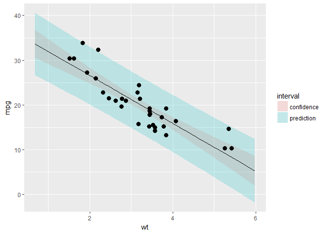

# JHU DataScience Specialization/Cousers Reproducible Data/Week1-4/Regression Model Quizes

# Quizes

主要练习手工计算回归模型的基础方法


## Week 2

### Quiz 1

手算均值

```r
x <- c(0.18, -1.54, 0.42, 0.95)
w <- c(2, 1, 3, 1)
mu.y <- sum(w * x) / sum(w)
sprintf("mean of y is : %f",mu.y)
```

```
## [1] "mean of y is : 0.147143"
```

### Quiz 2 

线性回归

```r
x <- c(0.8, 0.47, 0.51, 0.73, 0.36, 0.58, 0.57, 0.85, 0.44, 0.42)
y <- c(1.39, 0.72, 1.55, 0.48, 1.19, -1.59, 1.23, -0.65, 1.49, 0.05)
pander(lm(y~x)) #THROUGH THE ORIGIN
```


--------------------------------------------------------------
     &nbsp;        Estimate   Std. Error   t value   Pr(>|t|) 
----------------- ---------- ------------ --------- ----------
 **(Intercept)**    1.567       1.252       1.252     0.246   

      **x**         -1.713      2.105      -0.8136    0.4394  
--------------------------------------------------------------

Table: Fitting linear model: y ~ x

```r
pander(lm(y~x-1)) #去除截距
```


-----------------------------------------------------
 &nbsp;   Estimate   Std. Error   t value   Pr(>|t|) 
-------- ---------- ------------ --------- ----------
 **x**     0.8263      0.5817      1.421     0.1892  
-----------------------------------------------------

Table: Fitting linear model: y ~ x - 1

### Quiz 3

mtcars 回归系数

----------------------
 (Intercept)     wt   
------------- --------
    37.29      -5.344 
----------------------

### Quiz 4

练习求b1
$$
Cor(Y,X) = 0.5 \qquad
Sd(Y) = 1  \qquad Sd(X) = 0.5 \\ 
\beta_1 = Cor(Y,X) * \frac{Sd(Y)}{Sd(X)}
$$


```r
B1 = 0.5 * 1 / 0.5
```

### Quiz 5


```r
corr <- .4; emean <- 0; varr1 <- 1
varr2 <- 1; b0 <- 0; x <- 1.5
b1 <- corr * sqrt(varr1) / sqrt(varr2)
(y <- b0 + b1 * x)
```

```
## [1] 0.6
```

### Quiz 6

```r
x <- c(8.58, 10.46, 9.01, 9.64, 8.86)
(x - mean(x)) / sd(x) # Choose No.1
```

```
## [1] -0.9718658  1.5310215 -0.3993969  0.4393366 -0.5990954
```

### Quiz 7


```r
x <- c(0.8, 0.47, 0.51, 0.73, 0.36, 0.58, 0.57, 0.85, 0.44, 0.42)
y <- c(1.39, 0.72, 1.55, 0.48, 1.19, -1.59, 1.23, -0.65, 1.49, 0.05)
lm(y~x)
```

```
## 
## Call:
## lm(formula = y ~ x)
## 
## Coefficients:
## (Intercept)            x  
##       1.567       -1.713
```

### Quiz 8

> It must be identically 0.

### Quiz 9


```r
x <- c(0.8, 0.47, 0.51, 0.73, 0.36, 0.58, 0.57, 0.85, 0.44, 0.42)
mean(x)
```

```
## [1] 0.573
```

### Quiz 10

$$
\beta_1=Cor(Y,X)*Sd(Y)/Sd(X) \\ 
Y_1=Cor(Y,X)*Sd(X)/Sd(Y) \\
\beta_1/Y_1= Sd(Y)^2/Sd(X)^2 = Var(Y)/Var(X)
$$

## Week 3

### Quiz 1

求系数


```r
x <- c(0.61, 0.93, 0.83, 0.35, 0.54, 0.16, 0.91, 0.62, 0.62)
y <- c(0.67, 0.84, 0.6, 0.18, 0.85, 0.47, 1.1, 0.65, 0.36)
fit <- lm(y~x)
pander(summary(fit)$coefficients)
```


--------------------------------------------------------------
     &nbsp;        Estimate   Std. Error   t value   Pr(>|t|) 
----------------- ---------- ------------ --------- ----------
 **(Intercept)**    0.1885      0.2061     0.9143     0.391   

      **x**         0.7224      0.3107      2.325    0.05296  
--------------------------------------------------------------

### Quiz 2

总平方和与回归与残差关系

$$
y_i = \beta_0 + \beta_1 x_i + e_i \\
\hat y_i = \beta_0 + \beta_1 x_i + e_i \\
e_i = y_i - \hat y_i \\
SS_{total} = \|y_i-\bar y \mathbf{1}\|^2 = \sum_{i=1}^n (y_i-\bar y)^2 \\ 
= \| \hat y_i-\bar y \mathbf{1}\|^2 + \|\hat \epsilon\|  
= \sum_{i=1}^n (\hat y_i-\bar y)^2 + \sum_{i=1}^n (y_i-\hat y)^2 \\ 
= SS_{regression} + SS_{residual} \\ \mathbf{1} = (1,1,\ldots,1)^T
$$

平方和与残差

$$
SS_x = \sum_{i=1}^n {(x_i - \bar x)^2} \\
e_i = y_i - (\beta_1x_i + \beta_0) \\
\hat \sigma^2 = \frac{1}{n-2} \sum_{i=1}^n e_i^2 = \frac{1}{n-2} SS_{residual} \sim \chi_{(n-2)}^2
$$


```r
# init
n <- length(x)
beta1 <- cor(y, x) * sd(y) / sd(x)
beta0 <- mean(y) - beta1 * mean(x)
ssx <- sum((x - mean(x))^2)
e <- y - (beta1 * x + beta0)
sigma <- sqrt(sum(e^2) / (n-2))
```

方差与系数方差关系

$$
\sigma^2_{\hat\beta_1}=Var(\hat\beta_1)=\frac{\sigma^2}{SS_x}\\
\sigma^2_{\hat\beta_0}=Var(\hat\beta_0)=(\frac{1}{n}+\frac{\bar X^2}{SS_x})\sigma^2 \\
$$

$$
R^2 = \frac{SS_{regression}}{SS_{total}} = \frac{\sum_{i=1}^n (\hat y_i-\bar y)^2}{\sum_{i=1}^n (y_i-\bar y)^2}
$$
t分布与方差
$$
\frac{\hat\beta_j-\beta_j}{\sigma_{\hat\beta_j}} \sim t_{\beta_j}(n-p)
$$


```r
# 计算 Beta1
seBeta0 <- sqrt(1/n + mean(x)^2/ssx)*sigma
seBeta1 <- sigma / sqrt(ssx)
tBeta0 <- beta0 / seBeta0
tBeta1 <- beta1 / seBeta1
pBeta0 <- 2 * pt(tBeta0, df = n-2, lower.tail = FALSE)
pBeta1 <- 2 * pt(tBeta1, df = n-2, lower.tail = FALSE)
```


-------------------------------------------------------------
     &nbsp;        Estimate   Std. Error   t value   P(>|t|) 
----------------- ---------- ------------ --------- ---------
 **(Intercept)**    0.1885      0.2061     0.9143     0.391  

      **x**         0.7224      0.3107      2.325    0.05296 
-------------------------------------------------------------

### Quiz 3

Dataset: mtcars


```r
# 构造模型
fit <- lm(mpg~wt,mtcars)
pander(summary(fit))
```


---------------------------------------------------------------
     &nbsp;        Estimate   Std. Error   t value   Pr(>|t|)  
----------------- ---------- ------------ --------- -----------
 **(Intercept)**    37.29       1.878       19.86    8.242e-19 

     **wt**         -5.344      0.5591     -9.559    1.294e-10 
---------------------------------------------------------------


--------------------------------------------------------------
 Observations   Residual Std. Error   $R^2$    Adjusted $R^2$ 
-------------- --------------------- -------- ----------------
      32               3.046          0.7528       0.7446     
--------------------------------------------------------------

Table: Fitting linear model: mpg ~ wt

```r
sumCoef <- summary(fit)$coefficients
b0 <- sumCoef[1,1]
b1 <- sumCoef[2,1]
seb0 <- sumCoef[1, 2]
seb1 <- sumCoef[2, 2]
b0i <- b0 + c(-1, 1) * qt(.9, df = fit$df) * seb0
b1i <- b1 + c(-1, 1) * qt(.9, df = fit$df) * seb1 
x0 <- mean(mtcars$wt)
```


----------------------------------------
     &nbsp;        fit     lwr     upr  
---------------- ------- ------- -------
 **confidence**   20.09   18.99   21.19 

 **prediction**   20.09   13.77   26.41 

   **manual**     20.09   15.27   24.91 
----------------------------------------

<!-- -->

### Quiz 4

> The estimated expected change in mpg per 1,000 lb increase in weight.

### Quiz 5


```r
pander(predict(fit,newdata = data.frame(wt=3000/1000),interval = ("prediction")))
```


-----------------------
  fit     lwr     upr  
------- ------- -------
 21.25   14.93   27.57 
-----------------------

### Quiz 6


----------------------
  fit     lwr    upr  
------- ------- ------
 20.09   12.58   27.6 
----------------------


-----------------------
  fit     lwr     upr  
------- ------- -------
 20.09   18.99   21.19 
-----------------------


-----------------------
  fit     lwr     upr  
------- ------- -------
 20.09   13.77   26.41 
-----------------------

### Quiz 7


```r
fit3<-lm(mpg~I(wt/100),mtcars)
pander(summary(fit3)$coefficients)
```


---------------------------------------------------------------
     &nbsp;        Estimate   Std. Error   t value   Pr(>|t|)  
----------------- ---------- ------------ --------- -----------
 **(Intercept)**    37.29       1.878       19.86    8.242e-19 

  **I(wt/100)**     -534.4      55.91      -9.559    1.294e-10 
---------------------------------------------------------------

```r
#It would get multiplied by 100.
```

### Quiz 8

>The new intercept would be bhat0???cbhat1

### Quiz 9


```r
fit1 <- lm(mpg ~ wt, data = mtcars)
fit2 <- lm(mpg ~ 1, data = mtcars)
num <- sum((predict(fit1)-mtcars$mpg)^2)
den <- sum((predict(fit2)-mtcars$mpg)^2)
num/den
```

```
## [1] 0.2471672
```

```r
1 - summary(fit1)$r.squared#options
```

```
## [1] 0.2471672
```


### Quiz 10


```r
x <- c(0.61, 0.93, 0.83, 0.35, 0.54, 0.16, 0.91, 0.62, 0.62)
y <- c(0.67, 0.84, 0.6, 0.18, 0.85, 0.47, 1.1, 0.65, 0.36)
sum(resid(lm(y ~ x)))
```

```
## [1] 1.110223e-16
```

```r
sum(resid(lm(y ~ 1)))
```

```
## [1] -3.816392e-17
```

```r
sum(resid(lm(y ~ x - 1)))
```

```
## [1] 0.220565
```

```r
#If an intercept is included, then they will sum to 0.
```


## Week 4

### Quiz 1

---------------------------------------------------------------------
        &nbsp;           Estimate   Std. Error   t value   Pr(>|t|)  
----------------------- ---------- ------------ --------- -----------
    **(Intercept)**       29.74       2.541       11.7     2.688e-12 

 **I(1 * (cyl == 8))**    -1.815      1.358      -1.337      0.192   

 **I(1 * (cyl == 4))**    4.256       1.386       3.07     0.004718  

        **wt**            -3.206      0.7539     -4.252    0.000213  
---------------------------------------------------------------------

```
## [1] -6.07086
```

### Quiz 2


---------------------------------------------------------------------
        &nbsp;           Estimate   Std. Error   t value   Pr(>|t|)  
----------------------- ---------- ------------ --------- -----------
    **(Intercept)**       19.74       1.218       16.21    4.493e-16 

 **I(1 * (cyl == 8))**    -4.643      1.492      -3.112    0.004152  

 **I(1 * (cyl == 4))**    6.921       1.558       4.441    0.0001195 
---------------------------------------------------------------------

### Quiz 3


```
## 
## Call:
## lm(formula = mpg ~ factor(cyl) + wt, data = mtcars)
## 
## Coefficients:
##  (Intercept)  factor(cyl)6  factor(cyl)8            wt  
##       33.991        -4.256        -6.071        -3.206
```

```
## 
## Call:
## lm(formula = mpg ~ factor(cyl), data = mtcars)
## 
## Coefficients:
##  (Intercept)  factor(cyl)6  factor(cyl)8  
##       26.664        -6.921       -11.564
```

### Quiz 4


```
##               Estimate Std. Error   t value     Pr(>|t|)
## (Intercept)  33.990794   1.887793 18.005569 6.257246e-17
## I(wt * 0.5)  -6.411227   1.507791 -4.252065 2.130435e-04
## factor(cyl)6 -4.255582   1.386073 -3.070244 4.717834e-03
## factor(cyl)8 -6.070860   1.652288 -3.674214 9.991893e-04
```

函数step可以实现基于AIC准则的模型选择，最优模型为AIC值最小的


---------------------------------------------------------------
     &nbsp;        Estimate   Std. Error   t value   Pr(>|t|)  
----------------- ---------- ------------ --------- -----------
 **(Intercept)**    9.618        6.96       1.382     0.1779   

     **wt**         -3.917      0.7112     -5.507    6.953e-06 

    **qsec**        1.226       0.2887      4.247    0.0002162 

     **am**         2.936       1.411       2.081     0.04672  
---------------------------------------------------------------

Table: Fitting linear model: mpg ~ wt + qsec + am


### Quiz 5


```r
x <- c(0.586, 0.166, -0.042, -0.614, 11.72)
y <- c(0.549, -0.026, -0.127, -0.751, 1.344)
fit <- lm(y ~ x)
round(hatvalues(fit),4)
```

```
##      1      2      3      4      5 
## 0.2287 0.2438 0.2525 0.2804 0.9946
```

### Quiz 6

* 异常值

- 杠杆点
    - 杠杆点对回归系数没有影响，但是会影响决定系数，可以通过观察帽子矩阵来识别，杠杆作用的平均值为h=p/n，p为自变量个数，n为样本量，如果一个观测值的杠杆值>2h，则应考虑为杠杆点，考虑剔除或采取措施。R中可以通过hatvalues函数计算杠杆值。

- 影响点
    - 影响点有将回归线拉向它的趋势，因此会影响回归系数的值，可以通过COOK距离来判断，R中可以通过cooks.distance函数计算每个观测值的COOK距离。根据经验，如果距离大于1，则说明观测点为影响点。

- 此外，还可以通过dffits函数和dfbetas函数计算相应的值，如果dffits>2/根号p/n，那么可认为是影响点，如果dfbetas>2/根号n，也可认为是影响点，p为自变量个数，n为样本量


```r
x <- c(0.586, 0.166, -0.042, -0.614, 11.72)
y <- c(0.549, -0.026, -0.127, -0.751, 1.344)
fit <- lm(y ~ x)
round(dfbetas(fit),4)
```

```
##   (Intercept)         x
## 1      1.0621   -0.3781
## 2      0.0675   -0.0286
## 3     -0.0174    0.0079
## 4     -1.2496    0.6725
## 5      0.2043 -133.8226
```

```r
round(hatvalues(fit),4)
```

```
##      1      2      3      4      5 
## 0.2287 0.2438 0.2525 0.2804 0.9946
```


